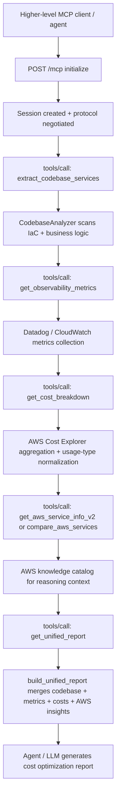

# MCP Architecture Requirements Map

This document maps the highlighted project requirements to the MCP server architecture, the exact MCP tools involved, and the code locations that implement each use case.

## MCP-Centric Architecture

| MCP layer | Responsibility | Exact implementation |
|---|---|---|
| Transport | Accept MCP over HTTP and stdio | `backend/app/main.py:214`, `backend/app/mcp_stdio.py:12` |
| Access control | Validate allowed origin and optional MCP API key | `backend/app/main.py:73` |
| Session layer | Create/read/delete `Mcp-Session-Id` session state | `backend/app/mcp.py:55` |
| Handshake layer | Handle `initialize`, negotiate protocol version, expose capabilities | `backend/app/mcp.py:146` |
| Protocol router | Dispatch `tools/*`, `resources/*`, `prompts/*` | `backend/app/mcp.py:112` |
| Tool execution | Validate tool args and route named MCP tools | `backend/app/mcp.py:171`, `backend/app/mcp.py:201` |
| Resource layer | Expose `prism://...` resources and resource templates | `backend/app/mcp.py:377`, `backend/app/mcp.py:653`, `backend/app/mcp.py:663` |
| Prompt layer | Expose reusable prompt templates for higher-level agents | `backend/app/mcp.py:402`, `backend/app/mcp.py:674`, `backend/app/mcp.py:699` |
| Adapter boundary | Convert domain objects to JSON-safe MCP output | `backend/app/domain_adapter.py:11`, `backend/app/domain_adapter.py:104` |
| Service/state layer | Actual business behavior behind MCP tools | `backend/app/services.py:18` |
| Persistence | Store shared MCP state in local JSON or DynamoDB | `backend/app/repository.py:22`, `backend/app/repository.py:32`, `backend/app/repository.py:64` |

## Highlighted Requirements

### Requirement 1

Task: Extract what cloud services are used in code and IaC, and identify how they are used.

| MCP use case | MCP tools | Exact lines | Notes |
|---|---|---|---|
| Scan repository and detect AWS services from Terraform, CloudFormation, boto3, and SDK/CDK usage | `extract_codebase_services`, `analyze_codebase` | Tool branches: `backend/app/mcp.py:238`, `backend/app/mcp.py:268` | `extract_codebase_services` is the cleaner MCP path today |
| Recursive repository scan | n/a | `backend/app/codebase_analyzer_v2.py:35` | Main scan entrypoint |
| Terraform parsing | n/a | `backend/app/codebase_analyzer_v2.py:104` | Detects `aws_*` resources |
| CloudFormation parsing | n/a | `backend/app/codebase_analyzer_v2.py:189` | Detects `AWS::...` resources |
| Python boto3/CDK parsing | n/a | `backend/app/codebase_analyzer_v2.py:267` | Detects `boto3.client/resource` and CDK usage |
| TypeScript/JavaScript parsing | n/a | `backend/app/codebase_analyzer_v2.py:334` | Detects AWS SDK/CDK usage |

### Requirement 2

Task: Use observability systems like Datadog to collect TPS, latency, error rate, and utilization metrics, and normalize monthly cloud costs by usage type.

| MCP use case | MCP tools | Exact lines | Notes |
|---|---|---|---|
| Fetch observability metrics | `get_observability_metrics` | `backend/app/mcp.py:280` | Preferred extended MCP metric tool |
| Older metric path | `get_datadog_metrics` | `backend/app/mcp.py:243` | Exposed, but less cleanly wired |
| Fetch service metrics | n/a | `backend/app/observability_client.py:33` | Entry for Datadog + CloudWatch |
| Datadog query path | n/a | `backend/app/observability_client.py:81` | Calls Datadog query API |
| CloudWatch fallback path | n/a | `backend/app/observability_client.py:153` | Pulls AWS service metrics when available |
| Aggregate monthly cost | `get_cost_breakdown` | `backend/app/mcp.py:297` | Preferred MCP cost tool |
| Older cost path | `get_aws_service_costs` | `backend/app/mcp.py:248` | Exposed, but less cleanly wired |
| Cost aggregation implementation | n/a | `backend/app/cost_aggregator_v2.py:22` | Main cost entrypoint |
| AWS Cost Explorer API call | n/a | `backend/app/cost_aggregator_v2.py:74` | Pulls grouped cost data |
| Usage-type normalization | n/a | `backend/app/cost_aggregator_v2.py:179` | Maps cost to read/write/request/storage/transfer |

### Requirement 3

Task: Gather AWS service knowledge to help an LLM reason about when to use which service and what to optimize.

| MCP use case | MCP tools | Exact lines | Notes |
|---|---|---|---|
| Fetch service knowledge | `get_aws_service_info_v2` | `backend/app/mcp.py:310` | Preferred service knowledge path |
| Compare services for a use case | `compare_aws_services` | `backend/app/mcp.py:314` | Good for higher-level reasoning agents |
| Older knowledge tool | `get_aws_service_info` | `backend/app/mcp.py:253` | Legacy path |
| AWS knowledge catalog | n/a | `backend/app/aws_service_knowledge.py:17` | Service metadata and optimization tips |
| Service lookup | n/a | `backend/app/aws_service_knowledge.py:682` | Alias-aware lookup |
| Service comparison | n/a | `backend/app/aws_service_knowledge.py:717` | Use-case matching |
| Cost estimate helper | n/a | `backend/app/aws_service_knowledge.py:801` | Lightweight estimation helper |

### Requirement 4

Task: Produce unified structured JSON that downstream agents can consume, and expose it as MCP tools.

| MCP use case | MCP tools | Exact lines | Notes |
|---|---|---|---|
| Build unified report | `get_unified_report` | `backend/app/mcp.py:318` | Best match for this requirement |
| Generate optimization report directly | `generate_cost_optimization_report` | `backend/app/mcp.py:257` | Older orchestration-style path |
| Unified schema assembler | n/a | `backend/app/schema.py:15` | Merges codebase + observability + cost + AWS insights |
| Recommendation input builder | n/a | `backend/app/schema.py:106` | Builds downstream-friendly decision inputs |
| Schema validation | n/a | `backend/app/schema.py:173` | Verifies the unified structure |

### Requirement 5

Task: Create an AI agent that uses the MCP tools above to generate a cost optimization report.

| MCP use case | MCP tools | Exact lines | Notes |
|---|---|---|---|
| Agent orchestration around unified report | Intended primary MCP tool: `get_unified_report` | `backend/app/open_source_agent.py:193` | Architecturally aligned with the requirement |
| LLM call abstraction | n/a | `backend/app/open_source_agent.py:41` | Supports Ollama or OpenRouter |
| Report generation from unified JSON | n/a | `backend/app/open_source_agent.py:106` | Converts unified report to structured optimization report |
| MCP fetch attempt | n/a | `backend/app/open_source_agent.py:223` | Current implementation does not yet match the JSON-RPC MCP transport exactly |

## MCP Tool Groups That Matter Most

| Group | Tools |
|---|---|
| Codebase extraction | `extract_codebase_services`, `analyze_codebase` |
| Metrics extraction | `get_observability_metrics`, `get_datadog_metrics` |
| Cost extraction | `get_cost_breakdown`, `get_aws_service_costs` |
| AWS reasoning/context | `get_aws_service_info_v2`, `compare_aws_services`, `get_aws_service_info` |
| Unified output | `get_unified_report`, `generate_cost_optimization_report` |
| Prompt layer for agents | `optimization-summary`, `recommendation-review`, `account-onboarding-guide`, `demo-walkthrough` |

## End-to-End MCP Flow For The Highlighted Design

## Pinpointed MCP Use-Case Flow

1. MCP session bootstrap
   - HTTP entry: `backend/app/main.py:214`
   - Session resolution: `backend/app/mcp.py:67`
   - Initialization response: `backend/app/mcp.py:146`

2. Discover extractor tools
   - Dispatch `tools/list`: `backend/app/mcp.py:126`
   - Tool catalog: `backend/app/mcp.py:424`

3. Extract cloud service usage
   - Dispatch `tools/call`: `backend/app/mcp.py:128`
   - Tool branch: `backend/app/mcp.py:268`
   - Repository scan: `backend/app/codebase_analyzer_v2.py:35`

4. Collect observability metrics
   - Tool branch: `backend/app/mcp.py:280`
   - Metrics collector: `backend/app/observability_client.py:33`
   - Datadog query path: `backend/app/observability_client.py:93`
   - CloudWatch path: `backend/app/observability_client.py:163`

5. Aggregate and normalize costs
   - Tool branch: `backend/app/mcp.py:297`
   - Cost aggregator: `backend/app/cost_aggregator_v2.py:22`
   - Cost Explorer call: `backend/app/cost_aggregator_v2.py:88`
   - Usage classification: `backend/app/cost_aggregator_v2.py:179`

6. Add AWS reasoning context
   - Service info branch: `backend/app/mcp.py:310`
   - Comparison branch: `backend/app/mcp.py:314`
   - Knowledge lookup: `backend/app/aws_service_knowledge.py:682`
   - Service comparison: `backend/app/aws_service_knowledge.py:717`

7. Produce unified structured output
   - Unified report branch: `backend/app/mcp.py:318`
   - Schema assembler: `backend/app/schema.py:15`

8. Generate final optimization report with agent
   - Agent run pipeline: `backend/app/open_source_agent.py:193`
   - LLM abstraction: `backend/app/open_source_agent.py:41`
   - Report generation: `backend/app/open_source_agent.py:106`

## Important Caveats

- The architecture strongly matches the intended 5-point design.
- The most complete MCP-native extractor path today is:
  - `extract_codebase_services`
  - `get_observability_metrics`
  - `get_cost_breakdown`
  - `get_aws_service_info_v2` or `compare_aws_services`
  - `get_unified_report`
- Some older extended tools exposed in `backend/app/mcp.py` rely on adapter methods not present in `backend/app/domain_adapter.py`, so they should be presented as prototype or in-progress rather than fully stable core paths.
- The open-source agent concept is implemented, but its MCP fetch path in `backend/app/open_source_agent.py:223` does not yet match the actual JSON-RPC MCP transport exposed by `POST /mcp`.
